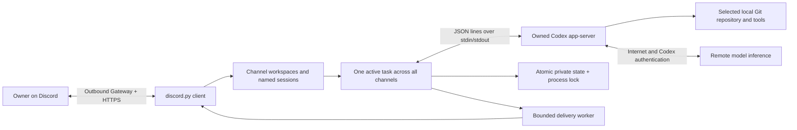

# Architecture and reliability

The bridge has no inbound listener. Local execution runs on the Pi, while model inference uses Codex's remote service. The Python service is intentionally small: discord.py is the only direct runtime dependency. Configuration, CLI, process handling and persistence use the standard library. Schema validation is a development dependency, not a general runtime framework.

## Module boundaries

- `config.py`: validated private TOML/environment settings, executable and repository identity.
- `state.py`: atomic durable replacement, permissions, backups and `flock`.
- `workspaces.py`: owner/server routing, channel selections, directory roots and the named-session catalog.
- `locks.py`: the task/workspace/maintenance lease shared by all channels and the updater.
- `rpc.py`: owned subprocess group, bounded JSON frames/write queue, correlation futures, pipe failure handling.
- `protocol.py`: exact 0.153.4 wire values and config/thread verification.
- `followups.py`: bounded ordered input to the active turn, acknowledgement/uncertainty tracking and shutdown.
- `engine.py`: authorization, message deduplication, task reservation, session selection, pending input and results.
- `delivery.py`: bounded prioritized jobs, inline pages for all replies, retry/reconciliation, cosmetic isolation.
- `discord_client.py`: Gateway events, permissions, button acknowledgement and HTTP adapter.
- `service.py` / `cli.py`: installation, unit escaping/validation, diagnostics and lifecycle commands.
- `deployment.py`: opt-in outbound GitHub CI checks, separate release preparation, idle-only switching, readiness, rollback and retention.

The public app-server [protocol guide](https://developers.openai.com/codex/app-server) describes the initialization/request/event lifecycle. This adapter's concrete wire formats come from the installed CLI's generated schemas in `tests/fixtures/codex-0.153.4`; current website examples are not assumed identical to that release.

## Independent lifecycles

The Gateway reconnects through discord.py. Codex starts lazily only when ordinary owner text is accepted. Each task starts a child, creates/resumes and verifies the thread, starts exactly one turn, then closes its child. The durable Codex thread supplies conversation continuity; the child need not stay running while idle. No personal Codex daemon or existing TARS service is stopped.

RPC requests have IDs and individual futures. Out-of-order responses resolve the matching future. The reader dispatches short in-memory handlers; it never awaits Discord sends, typing or a person's decision. Responses to pending input go through the RPC writer. A malformed/disconnected transport fails outstanding futures and the task; the bridge never resubmits the uncertain prompt.

Task phases are idle, initializing, running, awaiting approval, awaiting answer, stopping and failed. Gateway disconnected status is independent and displayed alongside the task phase. A typing indicator is decorative. Meaningful thread events update last observed activity, and the status reports event age without diagnosing quiet work as stuck.

Preparation stages are reported in `!status` and logged with the task ID. Repository/version checks, child startup, `initialize`, `config/read` and thread start/resume share one initialization deadline. Preparation RPCs use the initialization limit, with the outer deadline capping their combined time. Later RPCs such as `turn/start` and `turn/steer` retain the ordinary request limit. An initialization timeout names the last preparation step and confirms that this task’s prompt was not submitted; an uncertain `turn/start` timeout makes no such claim.

Full-task deadlines are opt-in: `timeouts.task = 0` means no scheduled cancellation. An explicit `!run` duration overrides the default for one atomic reservation and is recorded in active/interrupted task metadata. Enabled deadlines include initialization and human wait. Initialization, RPC, transport, human-input, delivery and shutdown limits remain separate and bounded. The bridge ends each task on Codex completion and never submits another turn automatically to fill a time budget.

## Atomic task and approval ownership

The owner message is checked against user/server/channel before any work. The busy check, persisted reservation and worker assignment have no intervening `await`. A concurrent ordinary message in that channel reserves a follow-up against the same task. One serial worker waits for `turn/start` acknowledgement, then sends `turn/steer` with the exact `threadId` and `expectedTurnId`. It does not override the task deadline, sandbox, reviewer or repository. Other channels still reject busy coding messages; there are no overlapping coding turns. The last 512 message IDs persist across restart.

Every session's engine acquires the same nonblocking `activity.lock` before reserving work, retaining it through initialization, user input and child cleanup. Workspace changes and the updater acquire that same lock. Directory/Git metadata lookups run outside the event loop, while the lease prevents another mutation/task from racing a selection. Directory listings have explicit scan/output bounds. The owner can bind channels in the configured server; each channel has separate named sessions and outbound delivery. Replies carry small session labels and completed-result headings, and callbacks find the originating engine even after selection changes.

A pending request gets a fresh random bridge ID in addition to the original RPC ID. Decisions validate user/server/channel, originating control message for buttons, complete-detail delivery, active task/turn, deadline, request identity and undecided status. A synchronous claim selects a single winning decision before any network yield. Both text commands and buttons call this exact function. Buttons acknowledge promptly before deciding. Only per-request acceptance/denial is offered; there are no session-wide accept or policy-amendment buttons.

A request gets controls only after complete details were delivered. File-change details are joined to the preceding `item/started` event by item ID. The complete supplied data is included; an oversized payload stops/rejects instead of showing an incomplete preview as sufficient information. Questions use the documented `!answer` interface; secret-input questions are rejected. Unsupported MCP elicitation, dynamic tools, legacy approval requests and other unknown server requests receive an explicit JSON-RPC method error with an actionable notice rather than hanging.

Codex `auto_review` changes who reviews eligible requests. It does not expand sandbox permissions. The bridge checks process `config/read` and the effective create/resume response, retains `on-request`/`workspace-write`, reports supported review-denial/warning events, and still displays any human request. See the official [automatic-review explanation](https://learn.chatgpt.com/docs/sandboxing/auto-review). Runtime review outcomes depend on Codex, managed policy, tools, authentication and service availability; process configuration alone is not proof of a particular action's review.

### Follow-up lifecycle

The input worker is separate from task execution, the RPC reader and Discord delivery. At most eight messages wait/in flight, each bounded to 64 KiB. Prompt bodies live only in memory until submitted. The active task stores a rolling window of 32 follow-up receipts (sequence number, Discord message ID and outcome), plus an accepted count, inside existing task metadata; no state-schema/config migration is needed. Input metadata is persisted before sending. The existing message deduplication applies to both initial prompts and follow-ups.

`received` in Discord is a bridge receipt; `accepted by Codex` requires a response with the expected turn ID. A correlated RPC rejection is distinguished from timeout, malformed acknowledgement or transport failure. Input is never retried and never falls back to a new turn. After an input failure, remaining unsent follow-ups are explicitly discarded and further follow-ups are refused for that task, preserving instruction order. A steer-only RPC timeout does not cancel otherwise healthy original work. Protocol transport failure still fails the affected task normally.

Completion and `!stop` seal input immediately, cancel the input worker, mark any in-flight input uncertain and discard unsent input before releasing the shared activity lease. These outcomes are appended to a successfully completed saved result, so `!last` can recover them when Discord delivery fails. On interruption/restart they remain in `last_interruption`; `!status full` exposes the receipt metadata, never the prompt bodies. A receipt marked `waiting` at crash was not confirmed sent; `sending` means acceptance is unknown. None are replayed. Approval/question controls remain tied to the original turn and require their own decision; ordinary text never answers them implicitly.

## State, uncertainty and bounded resources

`state.json` stores schema, canonical repository/Git-directory identity, thread ID, mode, active-task correlation fields, last interrupted task/message/turn metadata, interruption flag, last result and delivery marker, recently handled message IDs, and control-message IDs to invalidate after restart. Writes use a mode-600 temporary file in the same directory, flush/fsync, atomic replacement, then directory fsync. The directory is 700. One `flock` is held for the process lifetime; a crash releases the kernel lock without deleting its inode.

Session state schema remains 1. The workspace catalog is a separate schema-1 file; it indexes the original `state.json` as the initial `main` session without rewriting it. New sessions store state under opaque IDs in `sessions/`. Unknown schemas get a preserved backup and an explicit refusal; malformed state is left untouched. Repository identity is checked before reuse/work, and `!repo --fresh` deliberately creates independent history for a changed repository. State backups contain private result text; treat them as secrets. Codex stores its own rollout/history under its own configuration separately.

An active reservation encountered after restart becomes interrupted. Neither it nor a lost `turn/start` acknowledgement is replayed. A new ordinary message is an explicit continuation: inspect the repository/effects first. The last completed result is saved before sending. It is independent of a later interrupted task.

Task failure diagnostics are persisted in the existing interruption record before outbound delivery, with a 4,096-character bound and no prompt bodies or raw exception payloads. A durable marker written before `turn/start` distinguishes preparation failures from attempted submissions whose acceptance/effects may be uncertain. `!status full` recovers the last saved failure across restart; `!last` remains the last completed result. Finishing a failed task releases the shared activity lease, so a fresh explicit message can use the same session. No failure triggers automatic resubmission.

Bounds: eight channels, 64 saved sessions, 8 MiB JSON frames, 64 queued RPC writes, 16 pending human requests, 64 recent action-detail items with a 4 MiB aggregate bound, 4 MiB accumulated assistant text, 32 outbound jobs per channel including the in-flight job, 128 Discord cached messages, 512 persisted owner message IDs and 32 recent control IDs per session. Only one Codex child/task runs. High-volume/raw reasoning and delta events are discarded; stderr is drained and counted without retaining raw content. Complete long output is paginated lazily into inline messages; only one page per job is built at a time. There is no unbounded progress log buffer.

Outbound messages have stable visible delivery markers. Before retrying ambiguous HTTP sends, the worker scans the last 100 channel messages for matching bot-authored markers. This is bounded best-effort reconciliation, **not an exactly-once Discord guarantee**: deleted messages, history beyond that window or external changes can produce a duplicate. Transient history lookup failures and sends share three bounded attempts with 1/2-second backoff; permanent permission errors stop delivery. A final failed send gets one additional bounded history lookup to reconcile an ambiguous success. History failures are classified separately from send timeouts. Failure to read history avoids sending blindly. Final results remain available via `!last`; coding work is never rerun to recover delivery. Buttons can look active while disconnected, but decisions always recheck live request state.

Every reply uses inline pagination, including results, listings and approval details. Pages contain at most 1,800 UTF-16 code units including presentation-only code-fence wrappers, leaving room for markers within [Discord’s message content limit](https://docs.discord.com/developers/resources/message#create-message). The source is preserved exactly; standard code fences close and reopen on each page. Pages are generated lazily without a separate page-count cap. After each page, the job rejoins the queue: control invalidation and requests take priority, and ordinary replies can interrupt a long result. Controls become available only after all request details arrive. A result is marked delivered only after its final page succeeds. Retries reconcile each page independently. Native message text stays Unicode; no legacy decode/re-encode or punctuation replacement is applied.

Logs contain UTC timestamps, operation names, task/RPC/request correlation IDs, transitions and sanitized traceback function/line locations. They do not log prompt bodies, auth payloads, raw reasoning, source lines, locals or repository contents by default. Journald controls disk retention; see its local administrator settings if you need a smaller journal on SD storage.

The optional updater runs from a stable bootstrap venv under its own systemd timer. It prepares exact successful-main commits in separate venvs while the bot runs, then takes the activity lock for backup/switch/health checking. Readiness is tied to the service PID and systemd invocation, not a stale file or typing indicator. A durable transaction records the previous unit before mutation; failure restores code, never old coding requests. Retention preserves current/previous and registered repository paths. See [deployment design and limits](deployment.md).

Page markers include a fingerprint of the full delivery text and pagination format. Partial output from a different label/layout cannot satisfy recovery for newly paginated text. Recovery can repeat earlier pages after such a change; it never skips new text based on incompatible old page boundaries. Unchanged content retains per-page reconciliation.
