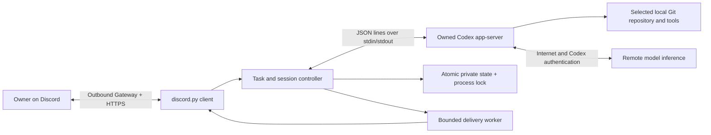

# Architecture and reliability

The bridge has no inbound listener. Local execution runs on the Pi, while model inference uses Codex's remote service. The Python service is intentionally small: discord.py is the only direct runtime dependency. Configuration, CLI, process handling and persistence use the standard library. Schema validation is a development dependency, not a general runtime framework.

## Module boundaries

- `config.py`: validated private TOML/environment settings, executable and repository identity.
- `state.py`: atomic durable replacement, permissions, backups and `flock`.
- `rpc.py`: owned subprocess group, bounded JSON frames/write queue, correlation futures, pipe failure handling.
- `protocol.py`: exact 0.153.4 wire values and config/thread verification.
- `engine.py`: authorization, message deduplication, task reservation, session selection, pending input and results.
- `delivery.py`: bounded prioritized jobs, complete text attachments, retry/reconciliation, cosmetic isolation.
- `discord_client.py`: Gateway events, permissions, button acknowledgement and HTTP adapter.
- `service.py` / `cli.py`: installation, unit escaping/validation, diagnostics and lifecycle commands.

The public app-server [protocol guide](https://developers.openai.com/codex/app-server) describes the initialization/request/event lifecycle. This adapter's concrete wire formats come from the installed CLI's generated schemas in `tests/fixtures/codex-0.153.4`; current website examples are not assumed identical to that release.

## Independent lifecycles

The Gateway reconnects through discord.py. Codex starts lazily only when ordinary owner text is accepted. Each task starts a child, creates/resumes and verifies the thread, starts exactly one turn, then closes its child. The durable Codex thread supplies conversation continuity; the child need not stay running while idle. No personal Codex daemon or existing TARS service is stopped.

RPC requests have IDs and individual futures. Out-of-order responses resolve the matching future. The reader dispatches short in-memory handlers; it never awaits Discord sends, typing, attachment upload or a person's decision. Responses to pending input go through the RPC writer. A malformed/disconnected transport fails outstanding futures and the task; the bridge never resubmits the uncertain prompt.

Task phases are idle, initializing, running, awaiting approval, awaiting answer, stopping and failed. Gateway disconnected status is independent and displayed alongside the task phase. A typing indicator is decorative. Meaningful thread events update last observed activity, and the status reports event age without diagnosing quiet work as stuck.

Full-task deadlines are opt-in: `timeouts.task = 0` means no scheduled cancellation. An explicit `!run` duration overrides the default for one atomic reservation and is recorded in active/interrupted task metadata. Enabled deadlines include initialization and human wait. Initialization, RPC, transport, human-input, delivery and shutdown limits remain separate and bounded. The bridge ends each task on Codex completion and never submits another turn automatically to fill a time budget.

## Atomic task and approval ownership

The owner message is checked against user/server/channel before any work. The busy check, persisted reservation and worker assignment have no intervening `await`. A concurrent ordinary message is rejected; there is no task queue and no overlapping edits. The last 512 message IDs persist across restart.

A pending request gets a fresh random bridge ID in addition to the original RPC ID. Decisions validate user/server/channel, originating control message for buttons, complete-detail delivery, active task/turn, deadline, request identity and undecided status. A synchronous claim selects a single winning decision before any network yield. Both text commands and buttons call this exact function. Buttons acknowledge promptly before deciding. Only per-request acceptance/denial is offered; there are no session-wide accept or policy-amendment buttons.

A request gets controls only after complete details were delivered. File-change details are joined to the preceding `item/started` event by item ID. The complete supplied data is included; an oversized payload stops/rejects instead of showing an incomplete preview as sufficient information. Questions use the documented `!answer` interface; secret-input questions are rejected. Unsupported MCP elicitation, dynamic tools, legacy approval requests and other unknown server requests receive an explicit JSON-RPC method error with an actionable notice rather than hanging.

Codex `auto_review` changes who reviews eligible requests. It does not expand sandbox permissions. The bridge checks process `config/read` and the effective create/resume response, retains `on-request`/`workspace-write`, reports supported review-denial/warning events, and still displays any human request. See the official [automatic-review explanation](https://learn.chatgpt.com/docs/sandboxing/auto-review). Runtime review outcomes depend on Codex, managed policy, tools, authentication and service availability; process configuration alone is not proof of a particular action's review.

## State, uncertainty and bounded resources

`state.json` stores schema, canonical repository/Git-directory identity, thread ID, mode, active-task correlation fields, last interrupted task/message/turn metadata, interruption flag, last result and delivery marker, recently handled message IDs, and control-message IDs to invalidate after restart. Writes use a mode-600 temporary file in the same directory, flush/fsync, atomic replacement, then directory fsync. The directory is 700. One `flock` is held for the process lifetime; a crash releases the kernel lock without deleting its inode.

No bridge schema predecessor has been published. Unknown schemas get a preserved backup and an explicit refusal; malformed state is left untouched. Repository mismatches fail startup. State backups contain private result text; treat them as secrets. Codex stores its own rollout/history under its own configuration separately.

An active reservation encountered after restart becomes interrupted. Neither it nor a lost `turn/start` acknowledgement is replayed. A new ordinary message is an explicit continuation: inspect the repository/effects first. The last completed result is saved before sending. It is independent of a later interrupted task.

Bounds: 8 MiB JSON frames, 64 queued RPC writes, 16 pending human requests, 64 recent action-detail items with a 4 MiB aggregate bound, 4 MiB accumulated assistant text, 32 outbound jobs, 128 Discord cached messages, 512 persisted owner message IDs and 32 recent control IDs. High-volume/raw reasoning and delta events are discarded; stderr is drained and counted without retaining raw content. Complete long output is split into UTF-8-safe attachments of at most 512 KiB. There is no unbounded progress log buffer.

Outbound messages have stable visible delivery markers. Before retrying ambiguous HTTP sends, the worker checks the last 100 bot-authored channel messages. This is bounded best-effort reconciliation, **not an exactly-once Discord guarantee**: deleted messages, history beyond that window or external changes can produce a duplicate. Failure to read history avoids sending blindly. Final results remain available via `!last`; coding work is never rerun to recover delivery. Buttons can look active while disconnected, but decisions always recheck live request state.

Logs contain UTC timestamps, operation names, task/RPC/request correlation IDs, transitions and sanitized traceback function/line locations. They do not log prompt bodies, auth payloads, raw reasoning, source lines, locals or repository contents by default. Journald controls disk retention; see its local administrator settings if you need a smaller journal on SD storage.
