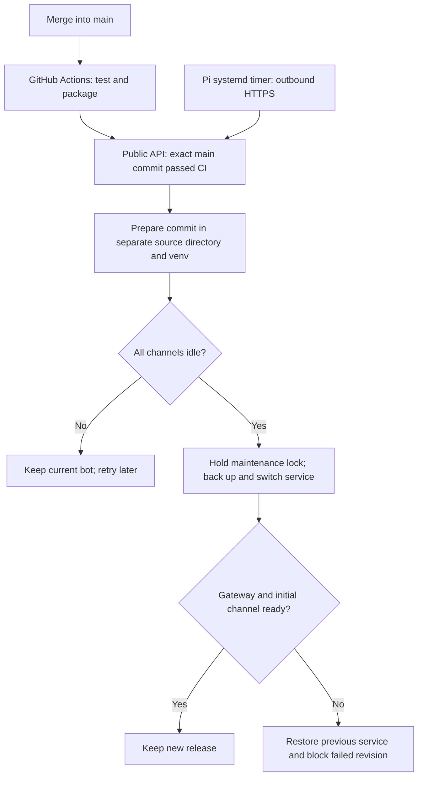

# Automatic deployment after merges to main

The bridge has GitHub Actions CI and an opt-in **pull updater on the Pi**: it checks the public GitHub API for successful CI on `main`, prepares a release locally, waits until coding work is idle, and switches the managed service. GitHub never needs to connect into the Pi. Your laptop may be closed.



GitHub's [workflow-run API](https://docs.github.com/en/rest/actions/workflow-runs#list-workflow-runs-for-a-workflow) exposes branch, event, commit, workflow and conclusion, and supports reading public runs without authentication. The updater requires the newest matching `ci.yml` run to be a successful **push to main** in the configured repository. A successful PR run, another workflow, a fork, a failed rerun or a merely newer version string is insufficient. It checks again after preparing the release so a newer main commit or changed CI outcome defers the switch.

A local timer avoids placing a general Actions runner on the Codex host. GitHub [warns against self-hosted runners for public repositories](https://docs.github.com/en/actions/reference/security/secure-use) because untrusted workflow code can compromise their persistent environment. This design still has a clear trust boundary: **any code you merge into the selected main branch may execute as your Linux user**. Protect merge access and require CI/review as appropriate. The bot does not auto-merge code as part of deployment.

## One-time activation — on the Pi

Do this only for the bridge instance you intend to manage. It never adopts an unmanaged personal TARS unit. Automatic updates begin only after you install and enable the timer.

1. Manually [update/reinstall the bridge](service.md#update-without-losing-credentials-or-conversation) to the current release, keeping private backups. The running bot must participate in the task/maintenance lock and report readiness using updater protocol 1; automatic adoption of a non-cooperating process is refused.
2. Run the normal `service install`, enable/start your managed bot, and confirm `!ping` and `!status` in Discord. Choose an idle time. Keep this bootstrap checkout/venv installed: it runs the updater itself, independently of the releases it deploys.
3. Install and test the updater, substituting your fork's `OWNER/REPO` if desired:

   ```bash
   cd "$HOME/services/discord-coding-agent"
   .venv/bin/discord-coding-agent --version
   .venv/bin/discord-coding-agent deploy install --repository Jarom-W/discord-coding-agent
   .venv/bin/discord-coding-agent deploy check
   .venv/bin/discord-coding-agent deploy status
   .venv/bin/discord-coding-agent deploy enable
   ```

Expected first output: updater installed, **timer not enabled/started automatically**. `deploy check` is an actual one-shot update attempt: it may report waiting for CI, waiting for idle, an unhealthy/legacy bot, or `Deployed COMMIT`. `deploy enable` explicitly enables and starts the timer. It needs a working systemd user bus; use the same user/SSH login as the bot, without sudo. [Linger](service.md#start-at-boot-and-after-logout) lets both user services continue after logout and start at boot.

The default generated units are `discord-coding-agent-update.service` and `discord-coding-agent-update.timer`. With a custom bot unit/config, pass the matching values on installation:

```bash
.venv/bin/discord-coding-agent --config "$HOME/.config/discord-coding-agent-demo/config.toml" deploy install --repository YOUR-ACCOUNT/YOUR-FORK --unit-name discord-coding-agent-demo.service
.venv/bin/discord-coding-agent --config "$HOME/.config/discord-coding-agent-demo/config.toml" deploy enable
```

All later `deploy` commands read the unit name from that config directory's `deployment.toml`. Use a separate config directory for every managed instance. Installation is idempotent, validates both units with `systemd-analyze`, and backs up changed settings/units before replacement. It captures the installing shell's PATH for Git, Python, Codex and npm/nvm prerequisites.

No token is required for this public-repository updater. No Pi SSH key, Discord token or Codex authentication is added to GitHub Actions. Private GitHub sources and GitHub Enterprise hosts are not supported by this updater version. Your **coding** repositories may still be private and use local Git authentication independently.

## What happens on a merge

The existing CI workflow runs on pushes and PRs. After a merge, the `push` run for that exact new main SHA must finish successfully. The Pi polls with a systemd timer: `OnUnitInactiveSec=300`, plus up to 30 seconds of jitter, with an initial check after two minutes. See the upstream [systemd timer specification](https://github.com/systemd/systemd/blob/main/man/systemd.timer.xml). There is no incoming webhook or open web port. Normal polls use one or two API requests; GitHub's [unauthenticated rate limit](https://docs.github.com/en/rest/using-the-rest-api/rate-limits-for-the-rest-api) is shared by the host's public IP. A rate-limit/network error leaves the running bot alone and a later timer tick can retry.

The updater fetches the exact commit into its own release directory, checks `FETCH_HEAD`, creates a separate venv, installs hash-locked runtime wheels and the bridge package, runs `pip check` and local `doctor`, and validates the candidate unit. It clears inherited Git destination/config variables and disables global/system Git configuration for its own commands; public fetches need no credential helper. It never runs `git pull` in a coding repository or modifies a running venv. Dependency wheels must exist for the Pi's Python/ARM64 platform; otherwise preparation fails without replacing the bot. Preparing a release uses Pi CPU/storage but does not stop healthy coding work.

All channels and the updater share `STATE_DIR/activity.lock`. Once idle, the updater acquires it, so a new message cannot slip between the idle check and restart. Messages during maintenance are explicitly rejected as not submitted. It backs up the managed unit, private config and JSON session/catalog state, then switches only the managed bot service. It retains each selected repository/session and never replays a coding task. A long-running task or pending approval can defer deployment indefinitely; use `!stop` yourself if you want it interrupted.

Readiness requires an active systemd service and a private `ready.json` from the **same PID and systemd invocation**. The bot writes that record only after the Gateway is ready and the initial channel's required permissions are available. An old process's record cannot make a new one healthy. This verifies Gateway/primary-channel startup, not a message round trip, every additional channel, Codex inference, account allowance or runtime tool behavior. Use `!ping` and a disposable read-only task for those checks.

If candidate startup fails, the updater restores the previous service unit and checks its readiness. It records the failed SHA so a timer does not repeatedly restart into the same bad revision. If rollback also fails, a durable transaction remains for the next recovery attempt and local diagnosis. The rollback target is saved **before** stopping or replacing anything, so an interrupted deployment can recover on a later invocation, waiting again if coding work is active. State backups are never restored automatically because doing so could discard newer work or replay uncertainty.

## Settings and storage

Settings are in `deployment.toml` next to your private bot config; they are deliberately separate from it. Example values generated by `deploy install`:

```toml
repository = "YOUR-ACCOUNT/YOUR-FORK"
directory = "/home/YOUR-USER/.local/share/discord-coding-agent/discord-coding-agent"
unit = "discord-coding-agent.service"
interval = 300
preparation = 1800
network = 30
health = 120
```

Use actual paths. You may choose a different absolute release location with `deploy install --repository OWNER/REPO --directory /absolute/path`. Keep releases separate from the bootstrap installation, coding repositories, config and state. The default uses `$XDG_DATA_HOME` or `~/.local/share`.

All timeout values are positive finite seconds. `interval` is at least 300; `preparation` is the shared budget for Git/venv/pip/doctor preparation; `network` is the HTTPS read/socket timeout; `health` bounds each readiness-wait stage. Individual `systemctl` operations also have bounded limits. These settings do not change coding-task deadlines. Change timer settings locally and rerun `deploy install` without repository/directory arguments, then `deploy disable` and `deploy enable` to reload the timer schedule.

Release source/venvs live under `directory/releases/SHA`; private session backups under `directory/backups/SHA-TIMESTAMP`; `deployment.json` records current, previous, failed and interrupted-switch metadata. The updater normally retains the newest three release copies and state backups, plus any current/previous or registered coding-repository paths it must protect. It removes only directories with its own matching marker. Ten accumulated release directories block further preparation pending local cleanup, preventing indefinite growth if protected/failed copies accumulate. Private config/unit backups also remain at their original locations for manual retention management.

Do not edit or work inside managed release directories. Never remove current/previous releases or the bootstrap updater venv. Before removing an incomplete candidate after a preparation failure, confirm its exact SHA/path, verify it is neither current nor previous in `deploy status`, and preserve anything you changed manually. Then move that incomplete directory outside `releases` and use `deploy check --retry`. Do not remove a coding repository to free deployment space.

## Status, pause, rollback and removal — on the Pi

```bash
.venv/bin/discord-coding-agent deploy status
systemctl --user list-timers discord-coding-agent-update.timer --all
systemctl --user status discord-coding-agent-update.service --no-pager -l
journalctl --user -u discord-coding-agent-update.service -n 200 --no-pager -o short-iso
.venv/bin/discord-coding-agent deploy disable
.venv/bin/discord-coding-agent deploy rollback
```

`status` shows recorded revisions and the timer name; `list-timers` shows actual scheduling. A oneshot updater is normally inactive between checks. `disable` stops future timer scheduling; an already-running check can finish. Run rollback only after that check finishes; operations share an updater lock and return a clear deferral if another update/task owns it. Rollback switches code/unit only; it does not restore old conversations, undo edits, or undo remote effects. Keep the timer disabled to pin the result. `deploy check --retry` deliberately allows another attempt at a blocked revision.

To remove automatic updating:

```bash
.venv/bin/discord-coding-agent deploy uninstall
```

This disables/removes only the managed updater units with backups and stops a running updater. It retains bot service/config/state, release directories, coding repositories and Codex auth. If an updater was interrupted during a switch, run `deploy check` to recover its saved transaction before deleting the bootstrap tools or doing a manual rollback. For a full bridge uninstall, disable/uninstall the updater **first**, then use the bot's `service uninstall`.

Auto-deployment updates the bot's versioned release, not the bootstrap updater itself. To update the updater or its protocol, disable its timer, wait until it is inactive, follow the normal Git/pip update in the bootstrap checkout, run `deploy install`, and re-enable. Avoid `service install` from the bootstrap directory after managed deployment unless you deliberately want to point the bot back at that bootstrap installation. Codex CLI upgrades remain separate and are never performed by this updater.

## Acceptance and troubleshooting

### Verify the running bot

**In Discord:** send `!ping`. The current bridge reports `Bridge: VERSION; revision: COMMIT; replies: inline-text (no file uploads)`. `!status` includes the same identity even before binding a repository. A manual/bootstrap install reports the installed version and an unavailable revision; it does not guess from the checkout's current HEAD. The startup message also identifies the running release. A reply without these fields means this diagnostic change is not running in that process.

Every text page sent by the current bridge ends with `[dca:ID:inline:PAGE]`. A freshly posted attachment with a marker such as `[dca:ID:1/1]` came from an older delivery path. Check its timestamp and author: updating the bot does not convert existing attachments. A link written in the model's text is also different from a file uploaded by the bridge; include the short caption/marker in a bug report without sharing the file's private contents.

**On the Pi:** these checks are read-only; use your configured unit name if different:

```bash
cd "$HOME/services/discord-coding-agent"
.venv/bin/discord-coding-agent deploy status
systemctl --user show discord-coding-agent.service -p MainPID -p ExecStart -p FragmentPath
systemctl --user list-timers discord-coding-agent-update.timer --no-pager
journalctl --user -u discord-coding-agent-update.service -n 80 --no-pager -o short-iso
```

Current `deploy status` separates **Recorded current** from the **Running** version/revision/interpreter/package. It validates the live record against the systemd PID, invocation and configuration. Only a matching managed release is marked verified; a stopped bot, an old readiness record, a manual install or a legacy process without identity metadata is unverified. Likewise `deploy check` no longer says “Already deployed” from saved history alone. An unverified match causes no automatic service replacement. This is local installation identification, not tamper-proof attestation or a model/tool behavior check.

`ExecStart` should point into `directory/releases/COMMIT/.venv/bin/python` for a CD-managed release. A path into your bootstrap checkout means that copy is configured instead. `git log`, the bootstrap CLI's `--version`, and `deployment.json` do not establish which code an existing bot process loaded. Running `service install` from the bootstrap checkout after CD can repoint the unit; do that only deliberately. **The updater itself stays in the bootstrap venv:** install this release there using the [bootstrap update procedure](#settings-and-storage) to get the improved local deployment checks. Updating only the bot does not update the updater's CLI.

If the running commit is behind main, check the timer journal for pending main CI, busy work, a blocked failed candidate or rollback. After fixing the reported cause, `deploy check --retry` deliberately retries a failed revision while respecting the idle lock. An incomplete candidate must first be inspected and moved aside with a private backup, as described above; do not delete a running release or state to force a retry.

If the saved revision matches main but the unit points elsewhere, choose an idle maintenance window, disable the update timer and wait for any check to finish. Preserve the current unit/config/state as in the [service recovery guide](service.md#update-without-losing-credentials-or-conversation). Either deliberately reinstall the current bootstrap as your bot following that guide, or restore the existing verified release's unit using that release's `.venv/bin/discord-coding-agent service validate` and `service install`, then restart your managed service. Check `ExecStart` and `!ping` before re-enabling the timer. A bootstrap install reports an unavailable managed revision; its installed version and inline replies can still be checked. Do not edit deployment state to manufacture a match or stop an unrelated personal installation.

After the inline release is running, use **`!last` in the affected channel** to recover the selected session's saved result as new chat pages. It does not rerun the coding task or edit historical messages. No attachment permission is required for these pages.

### Other deployment failures

In a disposable/test instance, merge a harmless change into your configured fork, wait for main CI, run `deploy check`, and compare `deploy status` with that main SHA. Confirm `!ping`, session continuity and a read-only task. Repeat with an active task: the updater should prepare/defer and leave the task running. Test failed readiness/rollback only in that disposable instance. The automated suite simulates these outcomes and validates units; it does not prove live Pi systemd/Gateway operation.

- **No update:** inspect main's `push` CI, the configured public repository, timer state, user bus/linger, and `deploy status`. Failed/skipped/pending CI or active coding work defers deployment.
- **Legacy/not ready:** install/restart the current release manually and confirm the primary channel works. The updater will not stop an older, non-cooperating process.
- **Wrong/unmanaged unit:** use the correct `--config` and instance name. Do not alter marker lines to adopt a personal TARS service.
- **Build/architecture/storage failure:** the previous bot remains running. Check wheel availability for your Python/ARM64 host, free space, available memory and the preparation timeout. Installer output is suppressed in journal logs to avoid leaking credentials; reproduce the named step locally in a disposable release to inspect it privately.
- **Readiness or rollback failure:** inspect the bot journal, current unit, private deployment transaction, Message Content Intent/permissions/token and network. Preserve state; never blindly replay a previous coding request.
- **Corrupt deployment state:** it is left untouched. Stop future timer checks, preserve the release/state directories and unit, and restore a reviewed known-good managed unit through the service recovery guide. Do not guess a current revision by deleting deployment.json.

Share only sanitized revisions, operation names, actual timeout limits, platform versions and minimal reproduction details. Do not publish deployment backups, private config/state, tokens, authentication caches or raw installer logs.
